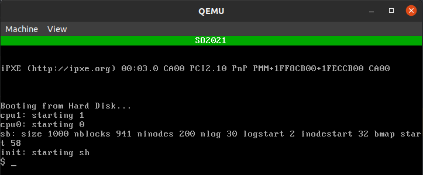

# Informe lab 2

- Fuentes, Tiffany
- Renison, Iván
- Vispo, Valentina Solange

---

**[README](README.md) | [CONSIGNA](consigna.md) | [To Do](todo.md)**

---

> Encargado del informe: Iván Renison

# Índice

# Desarrollo inicial

## Parte 1

    En esta parte el enunciado pide hacer una función que muestre un pie de pantalla que diga `SO2021` (el enunciado dice `SO2020`, pero suponemos que quedo así del año pasado) y llamarla al inicio del sistema.

    Para hacer esto se da la siguiente información:

    Se explica que VGA trabaja con buffers, en los cuáles está guardada la información que se está mostrando por la pantalla. Que cuando VGA está configurado en modo texto de `80×25` caracteres (que es como viene configurado cuando se inicia el sistema) el buffer está en la dirección `0xB0000`. Y que cada elemento del buffer se compone de 2 bytes, uno para el código ASCII del caracter, y otro para los atributos, o sea, el color del texto, el color del fondo y la fuente que se usa.

    Se da esta imagen que explica mejor los bits de los elementos del buffer:


    Se da un ejemplo en el cuál se guardan caracteres en el buffer con esta forma:

```c
*(int *)P2V(0xB8000) = 0x4348;
```

    Nosotros decidimos *modularizarlo* un poco, haciendo *2 funciones auxiliares*, `VGA_text_plot_letter` que pone una letra con sus atributos en una coordenada de la pantalla y `VGA_text_put_string` que pone un string en una coordenada de la pantalla dada. Esto nos pareció mejor que hacer como en el ejemplo, ya que así no hay que buscar el código ASCII de los caracteres que se ponen, y todo es menos repetitivo.

    Utilizando esas dos funciones hicimos la función `vgainit` para que muestre un el pie de pantalla así:



    Por último, al prototipo de la función `vgainit` lo agregamos a `defs.h` para que pueda ser usada desde cualquier lugar del **kernel** y la llamamos al comienzo de `main` en `main.c`.

    A esas funciones en ese momento las hicimos en `console.c`, pero después las movimos a `VGA_reg.c`, que es donde se pueden ver ahora, y también las modificamos un poco (ver explicación en "Extras en el kernel" (poner link)). Las versiones originales eran así:

```c
typedef struct{char s_ASCII_code; char s_atributes;} VGA_char;

#define VGA_text_array P2V(0xB8000)
#define VGA_text_array_pos(x, y) (VGA_char*)(VGA_text_array + (sizeof(VGA_char))*(x + y * 80))
#define VGA_text_width 80
#define VGA_text_height 25

static void
VGA_text_plot_letter(int x, int y, char letter, char atributes)
{
  // Solo se imprime si está dentro de la pantalla
  if(0 <= x && x < VGA_text_width && 0 <= y && y < VGA_text_height) {
    *VGA_text_array_pos(x, y) = (VGA_char){letter, atributes};
  }
}

static void
VGA_text_put_string(int x, int y, char* str, char atributes)
{
  if(str != NULL) {
    for(uint i = 0u; str[i] != '\0'; i++) {
      VGA_text_plot_letter(x, y, str[i], atributes);
      x++;
    }
  }
}

void
vgainit(void)
{
  for (int x = 0; x < VGA_text_width; x++) {
    VGA_text_plot_letter(x, 0, ' ', 0x2f);
  }
  VGA_text_put_string(37, 0, "SO2021", 0x2f);
}
```

## Parte 2

    En e sta parte se pide hacer funciones para cambiar entre modo gráfico y modo texto en el kernel (es decir, para ser ejecutadas en modo kernel). Para lograr eso se da como ayuda el código es la página https://files.osdev.org/mirrors/geezer/osd/graphics/modes.c.

    En ese código hay varios arreglos que tienen los registros de los distintos modos, y también hay una función `write_regs` que escribe los registros.

    Entonces, básicamente lo que se hace es escribir los registros correspondientes al arreglo del modo al que se quiere cambiar, o sea, se evaluá el arreglo del modo al que se quiere cambiar en la función `write_regs`.

    Y eso fue exactamente lo que hicimos: copiamos la función `write_regs` a `console.c`, cambiando las llamadas a `outportb` e `inportb` por llamadas a `outb` e `inb`, que son los equivalentes a esas funciones en xv6. Copiamos los arreglos `g_80x25_text` y `g_320x200x256`, que son los correspondientes a los modos que pide el enunciado, e hicimos en `console.c` las siguientes funciones:

```c
// Cambia a modo gráfico (320 x 200), si ya estaba en ese modo no hace nada
void
VGA_to_mode_graphic(void)
{
  write_regs(g_320x200x256);
}

// Cambia a modo gráfico (80 x 25), si ya estaba en ese modo no hace nada
void
VGA_to_mode_text(void)
{
  write_regs(g_80x25_text);
}
```

    Inicialmente este código se encontraba en el archivo `console.c`, pero luego de la modularización se colocaron todos las funciones relacionadas con VGA en el archivo `VGA_regs.c`.

    En el archivo `VGA_regs.c` se encuentra la declaración de los arreglos del modo gráfico y el modo texto, la función `write_regs` se encarga de escribir los registros necesarios para realizar el cambio al modo deseado, además, si bien se puede cambiar entre modos no es algo que el usuario pueda hacer libremente, solo sucede en el caso de que algún programa de usuario que ejecute necesite cambiar de modo, por ejemplo al ejecutar el programa `flappy` desde la consola se cambia a modo gráfico, y al salir del programa se cambia de vuelta a modo texto, es un cambio que realiza el programa automáticamente.

    Cuando se realiza un cambio del modo gráfico al modo texto, se ejecuta la función `write_fonts`, la cual se encuentra en `modes.c` y se encarga de recuperar las fuentes para que al volver al modo texto se pueda visualizar la consola correctamente y no queden datos que se escribieron al estar en modo gráfico.

## Parte 3

    Todo el código de la parte 2 es código para ser ejecutado en el kernel, pero no puede ser ejecutado en modo usuario, y por ende, en la parte 3 se pide implementar una llamada al sistema para que los programas de usuario puedan cambiar de modo, y también una llamada al sistema para pintar en la pantalla, ya que para pintar en la pantalla hay que guardar los valores de los colores en ciertas direcciones de memoria, lo cuál no se puede hacer en modo usuario.

    En xv6 las llamadas al sistema se puede hacer desde un programa de usuario usando la función cuyo prototipo está en `user.h`. Cuando se llama a una de esas funciones lo que pasa es que se ejecuta una función definida en `usys.S` a través de un macro, la cuál produce el trap de llamada al sistema que entra en modo kernel.

    Para que el kernel pueda saber cuál llamada al sistema ejecutar, cada llamada al sistema tiene un número asignado en `syscall.h`, el cuál es puesto en un registro por el macro de `usys.S` antes de hacer el trap. Cuando el trap se produce, se ejecuta la función `trap`, la cuál ve que es un trap por llamada al sistema y llama a la función `syscall` de `syscall.c`.

    En el archivo `syscall.c` hay un arreglo que tiene las direcciones de memoria en las cuales está el código de cada una de las llamadas al sistema, entonces, la función `syscall` lo que hace es llamada a la función correspondiente a esa llamada, usando el número de esa llamada para saber cuál ejecutar.

    La función de la cuál está la dirección de memoria en el arreglo de `syscall.c` es una función que se llama `sys_nombreDeLaLlamada` (y no `nombreDeLaLlamada` salo), y se tiene que encargar de, además de ejecutar la llamada al sistema en si, obtener los parámetros de la llamada, ya que como `syscall` desconoce cuales son los parámetros, y tiene que ejecutar una función que toma `void`. Para obtener los parámetros desde `sys_nombreDeLaLlamada` se pueden usar unas funciones que están definidas en `syscall.c` y que se encargan de hacerlo tomando el número de parámetro. Muchas de las llamadas al sistema en la función `sys_nombreDeLaLlamada` se encargan de obtener los parámetros y luego llamar a una función `nombreDeLaLlamada` que se encargue de ejecutar la función.

### `VGA_mode_switch`

    En esta llamada al sistema (que en el enunciado se pide como `modeswitch`, pero le cambiamos el nombre para que quede mas acorde al resto de las funciones que estábamos haciendo), lo que hicimos fue básicamente ver a que modo se quería cambiar, y hacer mas o menos lo mismo que en el punto 2:

```c
typedef int VGA_mode;
#define VGA_mode_text 0
#define VGA_mode_graphic 1

void
VGA_mode_switch(VGA_mode mode)
{
  if(mode == VGA_mode_graphic)
    write_regs(g_320x200x256);
  else if(mode == VGA_mode_text)
    write_regs(g_80x25_text);
}
```

Explicación VGA_mode_switch en parte 3 del informe

        Explicar nuestras llamadas al sistema

## Parte 4

        Explicación breve de como empezamos

# Puntos estrellas

- [x] Todo lo que implementaron puede ser modularizado de una manera más delicada. Teniendo en cuenta que son funciones para un mismo dispositivo pueden estar en un mismo archivo `vga.{c,h}`.
- [x] Agregar una nueva `syscall` `plotrectangle(int x1, int y1, int x2, int y2, int color)` para dibujar rectángulos en la pantalla (la idea es no tener que usar `for` para pintar un pixel por vez).
- [x] Programar la paleta para poder usar todos los colores *(si bien el modo gráfico es de **256** colores, la paleta está programada para 64 colores)*.
- [x] Recuperar las fuentes que se pierden cuando pasamos de modo gráfico a texto.

# Extras en el kernel

## `stdin_read`

## Uso de la paleta completa

## Recuperar las fuentes al volver a modo texto

Hay dos elementos importantes que participan en el cambio de modos: el espacio de memoria `0xA0000-0xBFFFF` donde se **mapea la información mostrada en la pantalla**, y los registros de VGA donde se configura cómo es interpretada esa sección de la memoria.

Como el **`modo gráfico`** **comparte** una **sección** de la **memoria** con el **`modo texto`**, al dibujar pixeles en el primero se sobrescribe información codificada para el segundo, y al cambiar se sobrescriben los registros. Ambas cosas deben ser recuperadas al estado anterior para que el modo texto funcione correctamente.

Inicialmente, por simplicidad, implementamos la conservación de las fuentes **copiando toda la sección gráfica de la memoria** en un arreglo estático. Este se copiaba en l array `VGA_graphic_array` (que actualmente está eliminado) e intercambiarlo con el buffer.

```c
/* Intercambia lo que está desde 0xA0000 hasta 0xBFFFF
 * con lo que esta en el arreglo buffer_mode */
static void VGA_switch_buffers(void);  // Utiliza VGA_graphic_array

/* Utiliza VGA_switch_buffers() dependiendo el modo actual */
void VGA_mode_switch(VGA_mode mode)
```

Cuando el modo actual es el gráfico, el arreglo conservaba la memoria del texto y viceversa.

Eventualmente esta idea fue descartada ya que no funcionaba correctamente y se optó por replicar el código de la *super ayuda* adaptado a nuestra arquitectura de xv6. Como por ejemplo:

| VGA          | XV6      |
| ------------ | -------- |
| `inportb()`  | `inb()`  |
| `outportb()` | `outb()` |

Utilizando las funciones:

```c
/* Imprime los registros del arreglo regs */
void dump_regs(uchar *regs);

/* Lee los registros actuales y los escribe en el arreglo regs */
void read_regs(uchar *regs);

/* Escribe en los registros del arreglo regs */
void write_regs(uchar *regs);

/* write font to plane P4 (assuming planes are named P1, P2, P4, P8) */
void write_font(uchar *buf, uint font_height);
```

Con esta función escribimos los registros, cambiamos de modo y se encargar de escribir las fuentes:

```c
void VGA_mode_switch(VGA_text_80x25);
```

El último inconveniente que tuvimos fue elegir correctamente la **base en memoria** donde se debían escribir las fuentes, el valor correcto era:

```c
// Anterior, incorrecto
- #define VGA_font_array 0xA0000

// Ahora, correcto
+ #define VGA_font_array P2V(0xB8000)
```

**Referencias importantes a considerar:**

* http://www.osdever.net/FreeVGA/vga/vga.htm

* http://www.osdever.net/FreeVGA/vga/vgareg.htm
  
  * http://www.osdever.net/FreeVGA/vga/vgareg.htm#intro

* http://www.techhelpmanual.com/70-video_graphics_array__vga_.html

* http://www.techhelpmanual.com/900-video_graphics_array_i_o_ports.html

* http://www.techhelpmanual.com/89-video_memory_layouts.html

## Uso de todos los modos de VGA

        Explicación de VGA

        Explicación de como usamos el `modes.c`

# El kernel final y como usarlo

# El flappy bird

## Cómo usarlo

## Cómo está hecho

### Modularización

            Módulos mas "generales" (`random` y `VGA_graphics`)

            Módulos del flappy

# Estilo del código

# Nuestra forma de trabajar

---

**[README](README.md) | [CONSIGNA](consigna.md) | [To Do](todo.md)**