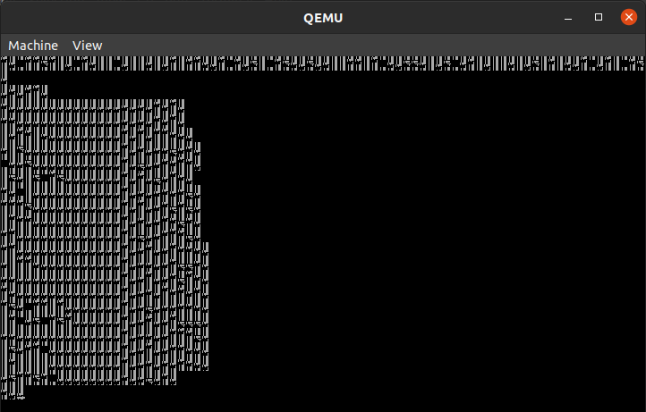
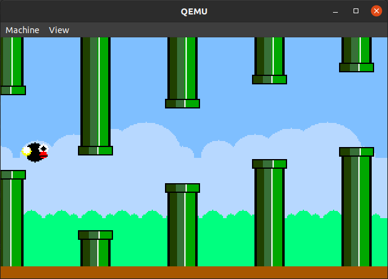

# Informe lab 2

- Fuentes, Tiffany
- Renison, Iván
- Vispo, Valentina Solange

---

**[README](README.md) | [CONSIGNA](consigna.md) | [To Do](todo.md)**

---

# Índice

- [Desarrollo inicial](#desarrollo-inicial)
  - [Parte 1](#parte-1)
  - [Parte 2](#parte-2)
  - [Parte 3](#parte-3)
    - [`VGA_mode_switch`](#vga_mode_switch)
    - [`VGA_plot_pixel`](#vga_plot_pixel)
    - [`VGA_plot_screen`](#vga_plot_screen)
  - [Parte 4](#parte-4)
- [Extras en el kernel](#extras-en-el-kernel)
  - [`stdin_read`](#stdin_read)
  - [Uso de la paleta completa](#uso-de-la-paleta-completa)
  - [Recuperar las fuentes al volver a modo texto](#recuperar-las-fuentes-al-volver-a-modo-texto)
- [El flappy bird](#el-flappy-bird)
  - [Funcionamiento](#funcionamiento)
    - [Modularización](#modularización)
- [Estilo del código](#estilo-del-código)
- [Nuestra forma de trabajar](#nuestra-forma-de-trabajar)

# Desarrollo inicial

## Parte 1

    En esta parte el enunciado pide hacer una función que muestre un pie de pantalla que diga `SO2021` (el enunciado dice `SO2020`, pero suponemos que quedo así del año pasado) y llamarla al inicio del sistema.

    Para hacer esto se da la siguiente información:

    Se explica que VGA trabaja con buffers, en los cuáles está guardada la información que se está mostrando por la pantalla. Cuando VGA está configurado en modo texto de `80×25` caracteres (que es como viene configurado cuando se inicia el sistema) el buffer está en la dirección `0xB0000`. Y que cada elemento del buffer se compone de 2 bytes, uno para el código ASCII del caracter, y otro para los atributos, o sea, el color del texto, el color del fondo y la fuente que se usa.

    Se da esta imagen que explica mejor los bits de los elementos del buffer:


    Se da un ejemplo en el cuál se guardan caracteres en el buffer con esta forma:

```c
*(int *)P2V(0xB8000) = 0x4348;
```

    Nosotros decidimos *modularizarlo* un poco, haciendo *2 funciones auxiliares*, `VGA_text_plot_letter` que pone una letra con sus atributos en una coordenada de la pantalla y `VGA_text_put_string` que pone un string en una coordenada de la pantalla dada. Esto nos pareció mejor que hacer como en el ejemplo, ya que así no hay que buscar el código ASCII de los caracteres que se ponen, y todo es menos repetitivo.

    Utilizando esas dos funciones hicimos la función `vgainit` para que muestre un el pie de pantalla así:


    Por último, al prototipo de la función `vgainit` lo agregamos a `defs.h` para que pueda ser usada desde cualquier lugar del **kernel** y la llamamos al comienzo de `main` en `main.c`.

    A esas funciones en ese momento las hicimos en `console.c`, pero después las movimos a `VGA_reg.c`, que es donde se pueden ver ahora, y también las modificamos un poco (ver explicación en [Extras en el kernel](#extras-en-el-kernel)). Las versiones originales eran así:

```c
typedef struct{char s_ASCII_code; char s_atributes;} VGA_char;

#define VGA_text_array P2V(0xB8000)
#define VGA_text_array_pos(x, y) (VGA_char*)(VGA_text_array + (sizeof(VGA_char))*(x + y * 80))
#define VGA_text_width 80
#define VGA_text_height 25

static void
VGA_text_plot_letter(int x, int y, char letter, char atributes)
{
  // Solo se imprime si está dentro de la pantalla
  if(0 <= x && x < VGA_text_width && 0 <= y && y < VGA_text_height) {
    *VGA_text_array_pos(x, y) = (VGA_char){letter, atributes};
  }
}

static void
VGA_text_put_string(int x, int y, char* str, char atributes)
{
  if(str != NULL) {
    for(uint i = 0u; str[i] != '\0'; i++) {
      VGA_text_plot_letter(x, y, str[i], atributes);
      x++;
    }
  }
}

void
vgainit(void)
{
  for (int x = 0; x < VGA_text_width; x++) {
    VGA_text_plot_letter(x, 0, ' ', 0x2f);
  }
  VGA_text_put_string(37, 0, "SO2021", 0x2f);
}
```

## Parte 2

    En esta parte se pide hacer funciones para cambiar entre modo gráfico y modo texto en el kernel (es decir, para ser ejecutadas en modo kernel). Para lograr eso se da como ayuda el código [modes.c](https://files.osdev.org/mirrors/geezer/osd/graphics/modes.c).

    En ese código hay varios arreglos que tienen los registros de los distintos modos, y también hay una función `write_regs` que escribe los registros.

    Entonces, básicamente lo que se hace es escribir los registros correspondientes al arreglo del modo al que se quiere cambiar, o sea, se evalúa el arreglo del modo al que se quiere cambiar en la función `write_regs`.

    Y eso fue exactamente lo que hicimos: copiamos la función `write_regs` a `console.c`, cambiando las llamadas a `outportb` e `inportb` por llamadas a `outb` e `inb`, que son los equivalentes a esas funciones en xv6. Copiamos los arreglos `g_80x25_text` y `g_320x200x256`, que son los correspondientes a los modos que pide el enunciado, e hicimos en `console.c` las siguientes funciones:

```c
// Cambia a modo gráfico (320 x 200), si ya estaba en ese modo no hace nada
void
VGA_to_mode_graphic(void)
{
  write_regs(g_320x200x256);
}

// Cambia a modo gráfico (80 x 25), si ya estaba en ese modo no hace nada
void
VGA_to_mode_text(void)
{
  write_regs(g_80x25_text);
}
```

    Inicialmente este código se encontraba en el archivo `console.c`, pero luego de la modularización se colocaron todos las funciones relacionadas con VGA en el archivo `VGA_regs.c`.

    En el archivo `VGA_regs.c` se encuentra la declaración de los arreglos del modo gráfico y el modo texto, la función `write_regs` se encarga de escribir los registros necesarios para realizar el cambio al modo deseado, además, si bien se puede cambiar entre modos no es algo que el usuario pueda hacer libremente, solo sucede en el caso de que algún programa de usuario que ejecute necesite cambiar de modo.

    Por ejemplo: al ejecutar el programa `flappy` desde la consola se cambia a modo gráfico, y al salir del programa se cambia de vuelta a modo texto, es un cambio que realiza el programa automáticamente.

    Cuando se realiza un cambio del modo gráfico al modo texto, se ejecuta la función `write_fonts`, la cual se encuentra en `modes.c` y se encarga de recuperar las fuentes para que al volver al modo texto se pueda visualizar la consola correctamente y no queden datos que se escribieron al estar en modo gráfico.

## Parte 3

    Todo el código de la [parte 2](#parte-2) es código para ser ejecutado en el kernel, pero no puede ser ejecutado en modo usuario, y por ende, en la parte 3 se pide implementar una llamada al sistema para que los programas de usuario puedan cambiar de modo, y también una llamada al sistema para pintar en la pantalla, ya que para pintar en la pantalla hay que guardar los valores de los colores en ciertas direcciones de memoria, lo cuál no se puede hacer en modo usuario.

    En xv6 las llamadas al sistema se pueden hacer desde un programa de usuario usando la función cuyo prototipo está en `user.h`. Cuando se llama a una de esas funciones lo que pasa es que se ejecuta una función definida en `usys.S` a través de un macro, la cuál produce el trap de llamada al sistema que entra en modo kernel.

    Para que el kernel pueda saber cuál llamada al sistema ejecutar, cada llamada al sistema tiene un número asignado en `syscall.h`, el cuál es puesto en un registro por el macro de `usys.S` antes de hacer el trap. Cuando el trap se produce, se ejecuta la función `trap`, la cuál ve que es un trap por llamada al sistema y llama a la función `syscall` de `syscall.c`.

    En el archivo `syscall.c` hay un arreglo que tiene las direcciones de memoria en las cuales está el código de cada una de las llamadas al sistema, entonces, la función `syscall` lo que hace es llamar a la función correspondiente de esa llamada, usando el número de esa llamada para saber cuál ejecutar.

    La función en la cuál está la dirección de memoria en el arreglo de `syscall.c` se llama `sys_nombreDeLaLlamada` (y no `nombreDeLaLlamada` solo), y se tiene que encargar de, además de ejecutar la llamada al sistema en sí, obtener los parámetros de la llamada, ya que `syscall` desconoce cuáles son los parámetros, y tiene que ejecutar una función que toma `void`.

    Para obtener los parámetros desde `sys_nombreDeLaLlamada` se pueden usar unas funciones que están definidas en `syscall.c` y que se encargan de hacerlo tomando el número de parámetro. Muchas de las llamadas al sistema en la función `sys_nombreDeLaLlamada` se encargan de obtener los parámetros y luego llamar a una función `nombreDeLaLlamada` que se encargue de ejecutar la función. En las nuestras hicimos exactamente eso.

### `VGA_mode_switch`

    En esta llamada al sistema (que en el enunciado se pide como `modeswitch`, pero le cambiamos el nombre para que quede más acorde al resto de las funciones que estábamos haciendo), lo que primero hicimos fue básicamente ver a que modo se quería cambiar, y hacer mas o menos lo mismo que en el punto 2.

    Después, cuando íbamos a hacer la siguiente llamada al sistema, nos dimos cuenta que hace falta poder saber cuál es el modo actual, así que agregamos una variable global que guarda el modo actual, y que se actualiza en cada cambio de modo. Con eso, el código nos quedó así:

```c
typedef int VGA_mode;
#define VGA_mode_text 0
#define VGA_mode_graphic 1

VGA_mode actual_mode = VGA_mode_text;

void
VGA_mode_switch(VGA_mode mode)
{
  if(mode == VGA_mode_graphic){
    write_regs(g_320x200x256);
    actual_mode = VGA_mode_graphic;
  }
  else if(mode == VGA_mode_text){
    write_regs(g_80x25_text);
    actual_mode = VGA_mode_text;
  }
}
```

### `VGA_plot_pixel`

    Para que los programas de usuario pueden dibujar cosas en la pantalla, en el enunciado se pide hacer una llamada el sistema que tome las coordenadas y el color, y pinte un pixel en la pantalla.

    Ya que no se especificaba nada acerca de qué tiene que pasar si se trata de pintar un pixel de fuera de la pantalla, nosotros decidimos hacer que simplemente no se pinte, ya que esto nos permite que si se está dibujando algo grande que se sale de la pantalla, se pueda dibujar con normalidad sin tener que hacer verificaciones extras.

    Otra cosa que no se aclara es qué tiene que pasar si se trata de pintar un pixel estando en modo texto. Nosotros decidimos también hacer que simplemente no se haga nada.

    Con eso, el código nos quedó así:

```c
#define VGA_graphic_width 320
#define VGA_graphic_hight 200
#define VGA_graphic_array ((uchar*)P2V(0x000A0000))
#define VGA_graphic_pos(x, y) ((uchar*)(VGA_graphic_array + y*VGA_graphic_width + x))

void
VGA_plot_pixel(int x, int y, uchar color)
{
  if(0 <= x && x < VGA_graphic_width && 0 <= y && y < VGA_graphic_hight
    && actual_mode == VGA_mode_graphic){
    *VGA_graphic_pos(x, y) = color;
  }
}
```

### `VGA_plot_screen`

    Si los programas de usuario a todo lo que dibujan lo tienen que poner en la pantalla pixel por pixel con `VGA_plot_pixel` se demoran mucho, ya que cada llamada al sistema es lenta. Para mitigar eso, en el enunciado se propone hacer una llamada al sistema `plotrectangle` que dibuje un rectángulo todo del mismo color. Esto ayuda un poco, pero no mucho, ya que solo sirve cuando el programa quiere dibujar un cuadrado todo del mismo color.

    Lo que nosotros decidimos hacer es hacer una llamada al sistema `VGA_plot_screen` que toma un arreglo que tiene los colores de todos los pixeles y los pone a todos en la pantalla. Esto permite al programa dibujar todo de forma rápida en un arreglo propio, y después ponerlo al todo al mismo tiempo en la pantalla.

    Esa llamada al sistema fue simplemente un `for` que copie todo de un arreglo al otro:

```c
void
VGA_plot_screen(uchar* buffer)
{
  if(actual_mode == VGA_mode_graphic){
    for(int j = 0; j < VGA_graphic_width*VGA_graphic_hight; j++){
      VGA_graphic_array[j] = buffer[j];
    }
  }
}
```

    A esas funciones al principio las habíamos hecho en el archivo `proc.c`, porque vimos que ahí estaban implementadas algunas de las otras llamadas al sistema, pero luego las movimos a `VGA.c`, y también las modificamos un poco por distintos motivos. Por eso, es que pusimos acá el código, para que se pueda ver como eran en el momento en el que las hicimos.

## Parte 4

    Para la parte 4 el enunciado hay que hacer algún programa de usuario que use el **VGA**. Nosotros decidimos hacer un juego de Flappy Bird ([Wikipedia - Flappy Bird](https://es.wikipedia.org/wiki/Flappy_Bird) para información sobre el original). Empezamos creando una carpeta para el juego y haciendo algunas cosas, pero nos dimos cuenta de que necesitamos implementar algunas cosas extra en el kernel antes de poder implementar completamente el juego.

# Extras en el kernel

    Nosotros decidimos hacer varias cosas más en el kernel, algunas por sugerencia del enunciado, y otras porque las necesitamos para hacer el Flappy Bird. Las cosas que hicimos fueron:

  • Una llamada al sistema `stdin_read` que dice si hay caracteres disponibles en el stdin, y si los hay los saca y los devuelve.

  • Usar 256 colores en el modo gráfico, ya que por defecto se pueden usar solo 64.

  • Recuperar las fuentes al volver a modo texto, ya que si no se hace nada, no se puede leer lo que se escribe en la pantalla.

    A continuación están explicadas todas:

## `stdin_read`

    En **xv6** la única llamada al sistema que permite leer caracteres de la entrada estándar es `read`. El funcionamiento de `read` es que toma el descriptor de archivo (0 en el caso de la entrada estándar), una dirección de memoria en la que guardar los caracteres, y el máximo de caracteres que guardar.

    Cuando se lee de la entrada estándar con `read` los caracteres no son leídos si no hay un salto de línea, es decir, si se llama a `read` cuando la entrada estándar está vacía, no se retorna hasta que se ingresa un salto de línea.

    Para hacer el Flappy Bird nosotros necesitamos que *cuando se presiona una tecla el flappy salte*, y cuando no se presiona una tecla que caiga (en ambos casos el juego tiene que seguir ejecutándose). Por eso, no podíamos usar la función `read`, que no retorna hasta que no se presiona la tecla enter.

    Entonces, para poder hacer el juego, decidimos agregar una nueva llamada al sistema `stdin_read`, la cuál toma una dirección de memoria en la que guardar un caracter, y mira si hay caracteres en la entrada estándar. En el caso de que no haya retorna `false`, y en el caso de que si haya retorna `true`, guarda el primer caracter en la dirección de memoria, y lo saca de la entrada estándar.

    Para poder hacer está función, vimos que cuando se produce un **trap por interrupción del teclado**, el caracter se guarda en `struct input` que está en `console.c`, que es como un buffer, y cuando se lee un caracter de la entrada estándar, se lo saca de ahí. Por lo cuál en la función `stdin_read` simplemente miramos si hay algún caracter en ese buffer, y si lo hay lo sacamos.

## Uso de la paleta completa

    Al cambiar a modo gráfico, si no se hace ninguno cambio adicional sólo se tienen disponibles *16 colores*, la idea era modificar la paleta para poder tener el uso de los 256 colores y poder graficar de mejor manera el Flappy Bird.

    Para poder extender la paleta hay que asignar cada color a través de los puertos de VGA, ya que no hay ningún lugar en la memoria donde se encuentren los colores. La idea para escribir la función que cambia la paleta se sacó de [sam46/xv6](https://github.com/sam46/xv6) y de [cGraphicsPalette](https://www.oocities.org/siliconvalley/park/7113/OldPages/cGraphicsPalette.html).

    Básicamente lo primero que hicimos fue **declarar un arreglo con 256 colores básicos de RGB en formato hexadecimal**, ya sabemos que el modelo RGB combina los colores primarios (rojo, verde y azul) para generar distintos colores, al expresarse en hexadecimal los primeros 8 bits corresponden a la intensidad del color rojo, los siguientes 8 al color verde y los últimos 8 al color azul.

Ejemplo: el color `0xFF0000`, `0xFF` en hexadecimal es 255 y representa la cantidad de color rojo que hay, como 255 es el máximo quiere decir que el color tiene la mayor cantidad de rojo posible, como los siguientes bytes están en 0, quiere decir que no hay verde ni azul, por lo que el `0xFF0000` representa el rojo.

    Lo que se debe hacer es escribir al puerto `0x3C8` en VGA, que es el que maneja las paletas, y se le indica cual es color de la paleta que se quiere modificar, y el color en si se registra en el puerto `0x3C9`, en este último puerto se debe escribir tres veces consecutivas (una para cada color primario), según las referencias que usamos, si no se escribe tres veces consecutivas al puerto `0x3C9` se puede tener comportamiento indefinido.

    La función `VGA_set_palette_color` es la que se encarga de recibir el índice del color de la paleta que se quiere modificar y el valor de los colores primarios, luego el `VGA_set_palette` se encarga de recorrer cada color en el arreglo `VGA_palette_256` que contiene los colores en formato hexadecimal, y de llamar a la función `VGA_set_palette_color` para escribir los valores en los puertos.

    Es importante recalcar que los puertos de VGA sólo reciben 6 bits, y un color RGB en formato hexadecimal tiene 24 bits, 8 para cada color primario, por esto para poder almacenar los bits correctamente primero lo que se hace es un shift del valor en hexadecimal de tal forma que los últimos 6 bits sean los 6 bits más significativos de cada color primario, y luego se hace un **and bit a bit** (*ver mini explicación abajo*) con el número `0x3F`, que representa el `0b00111111`, de esta forma sólo obtenemos 6 bits para cada color primario y los podemos escribir correctamente en los puertos.

Mini explicación **and bit a bit**:

```c
a     = 0b10110010
b     = 0b00111111
a & b = 0b00110010
```

    Al final, para poder cambiar correctamente la paleta lo que se hace es que al cambiar al modo gráfico luego de escribir sobre los registros necesarios se hace una llamada a `VGA_set_palette_color`. Para conocer como acceder a cada color utilizamos la paleta de `8-bit-mode` (que es la que tiene 256 colores) publicada en la página [vga_color_palettes](https://www.fountainware.com/EXPL/vga_color_palettes.htm).

## Recuperar las fuentes al volver a modo texto

    En modo texto cada caracter tiene (en el caso del `80×25`) 8×16 pixeles que pueden ser del color del caracter o del color del fondo. La información de como va cada pixel VGA la guarda como 128 bits consecutivos en memoria, en el que cada 8 bits se representa una fila de las 16 filas. Si se ven los 128 bits como un arreglo de 16 `uchar`s, se puede ver un poco la letra. Por ejemplo, esta sería la letra `B`:

```
0b00000000
0b00000000
0b11111100
0b01100110
0b01100110
0b01100110
0b01111100
0b01100110
0b01100110
0b01100110
0b01100110
0b11111100
0b00000000
0b00000000
0b00000000
0b00000000
```

    A toda la información de cada uno de los 256 caracteres cuando se está en modo texto, VGA la tiene guardada en su propia memoria, pero cuando se pasa a modo gráfico la borra, y si después se vuelve a modo texto, hay basura en esa parte de la memoria, y no se puede leer nada de lo que se imprime en la pantalla:



    VGA tiene una opción para pasarla la fuente que uno quiera.

    Hay dos elementos importantes que participan en el cambio de modos: el espacio de memoria `0xA0000-0xBFFFF` donde se **mapea la información mostrada en la pantalla**, y los registros de VGA donde se configura cómo es interpretada esa sección de la memoria.

    Como el **`modo gráfico`** **comparte** una **sección** de la **memoria** con el **`modo texto`**, al dibujar pixeles en el primero se sobrescribe información codificada para el segundo, y al cambiar se sobrescriben los registros. Ambas cosas deben ser recuperadas al estado anterior para que el modo texto funcione correctamente.

    Inicialmente, por simplicidad, implementamos la conservación de las fuentes **copiando toda la sección gráfica de la memoria** en un arreglo estático. Este se copiaba en el array `VGA_graphic_array` (que actualmente está eliminado) e intercambiarlo con el buffer.

```c
/* Intercambia lo que está desde 0xA0000 hasta 0xBFFFF
 * con lo que esta en el arreglo buffer_mode */
static void VGA_switch_buffers(void);  // Utiliza VGA_graphic_array

/* Utiliza VGA_switch_buffers() dependiendo el modo actual */
void VGA_mode_switch(VGA_mode mode)
```

    Cuando el modo actual es el gráfico, el arreglo conservaba la memoria del texto y viceversa.

    Eventualmente esta idea fue descartada ya que no funcionaba correctamente y se optó por replicar el código de la *super ayuda* adaptado a nuestra arquitectura de xv6. Como por ejemplo:

| VGA          | XV6      |
| ------------ | -------- |
| `inportb()`  | `inb()`  |
| `outportb()` | `outb()` |
| `vmemwr()`   | `P2V()`  |

    Utilizando las funciones:

```c
/* Escribe en los registros del arreglo regs */
void write_regs(uchar *regs);

/* write font to plane P4 (assuming planes are named P1, P2, P4, P8) */
void write_font(uchar *buf, uint font_height);
```

    Con esta función escribimos los registros, cambiamos de modo y se encargar de escribir las fuentes:

```c
void VGA_mode_switch(VGA_text_80x25);
```

    La función `vmemwr()` es *"Virtual Memory Write"* y esencialmente escribe en el espacio de Kernel traduciendo una *dirección física a la virtual correspondiente*. La adaptación en `xv6` fue simplemente usar la escritura normal de memoria pero aplicando la traducción provista P2V (*Physical to Virtual*).

    El último inconveniente que tuvimos fue elegir correctamente la **base en memoria** donde se debían escribir las fuentes, el valor correcto era:

```c
// Anterior, incorrecta base
- #define VGA_font_array P2V(0xA0000)

// Ahora, correcta base
+ #define VGA_font_array P2V(0xB8000)
```

**Referencias importantes a considerar:**

* http://www.osdever.net/FreeVGA/vga/vga.htm

* http://www.osdever.net/FreeVGA/vga/vgareg.htm
  
  * http://www.osdever.net/FreeVGA/vga/vgareg.htm#intro

* http://www.techhelpmanual.com/70-video_graphics_array__vga_.html

* http://www.techhelpmanual.com/900-video_graphics_array_i_o_ports.html

* http://www.techhelpmanual.com/89-video_memory_layouts.html

# El flappy bird

    Como mencionamos en [Parte 4](#parte-4) nosotros hicimos un Flappy Bird, a continuación una imagen de cómo se ve:



    El flappy bird esta como un programa de usuario, que cuando se compila y se inicia xv6 aparece en el ejecutable `flappy`. Para poder jugarlo hay que primero ejecutar ese ejecutable, y luego hay que pasando por los huecos de los tubos (lo verde son tubos) haciendo saltar al flappy. Para hacerlo saltar hay que presionar alguna tecla, que no sea la tecla escape, que se usa para salir del juego. Para salir del juego también se puede hacer con `ctrl` + `d`.

    Los huecos en los tubos se van generando pseudo-aleatoriamente según una semilla. Esa semilla se elige al azar al comienzo del juego, salvo que se le pase un parámetro al programa. Cuando se le pasa un parámetro al programa se elige una semilla según el valor numérico de los primeros 4 caracteres del parámetro.

## Funcionamiento

    El flappy funciona

    El código del flappy está dividido en varios módulos. 2 de esos módulos (`random` y `VGA_graphics`) son en realidad módulos mas generales, que sin duda podrían reutilizare para otras cosas. El resto de los módulos son específicos del flappy.

### Modularización

            Módulos mas "generales" (`random` y `VGA_graphics`)

            Módulos del flappy

# Estilo del código

# Nuestra forma de trabajar

---

**[README](README.md) | [CONSIGNA](consigna.md) | [To Do](todo.md)**